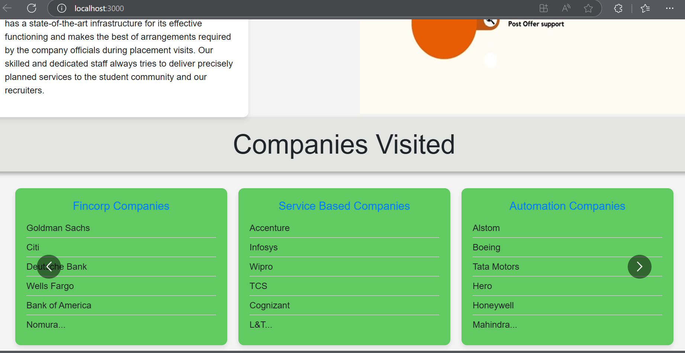
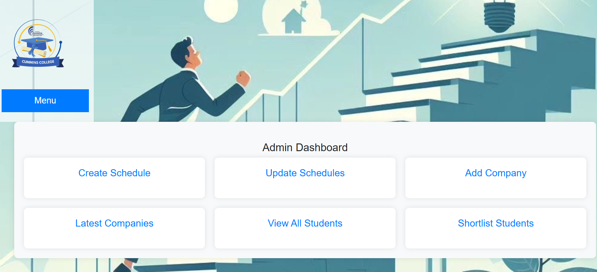

# Tyjfst_TNP_project
# Training and placement 

# Java full stack project : MySQL, servlets, JSP, JDBC

# Abstract

 Our Training and Placement (T&P) Cell website is a
 comprehensive platform designed to streamline campus
 recruitment and student placement processes. Built using a
 full-stack Java approach with a focus on RESTful APIs,
 this interactive web application offers dedicated interfaces
 for both students and administrators, ensuring a smooth and
 user-friendly.
 Students can access the platform to view upcoming
 company visits, schedules of events, and participate in
 forums for discussion. This allows them to stay informed
 about the latest opportunities and engage with their peers
 and the T&P Cell.
 The admin interface provides a robust dashboard that
 empowers administrators to manage the full recruitment
 lifecycle. This includes adding new companies, creating
 and updating schedules, and viewing registered students.
 The platform ensures efficient management of placement
activities and enhances communication between students
 and the T&P Cell.
 Leveraging HTML, CSS, JavaScript, React, JAAS and
 RESTful APIs, our T&P Cell website delivers an efficient,
 data-driven solution for enhancing career support and
 connectivity.
 # Admin Dashboard
 
 
 

